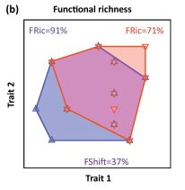

```{r setup, echo=FALSE, message = FALSE}
library(here)
```

Functional diversity, is defined as “the value and the range of those species and organismal traits that influence ecosystem functioning” (Tillman, 2001). 

Alpha Diversity Indices: **Functional richness** represents the area within the trait space occupied by the assemblage, **evenness** describes how equally species are distributed within the trait space, and **divergence** accounts for the distances of species away from the center of the trait space (Laliberté et al. 2022). These metrics are calculated using the corrected distance matrix, so they do not account for species abundances.

The following diagrams are from Mouillot et al. 2013 and represent hypothetical changes in FD indices after a disturbance to an ecosystem. 

  

**Functional dispersion** represents the average distance to the group centroid, where distances are weighted by abundance, and is calculated using the uncorrected distance matrix (Laliberté and Legendre 2010). 


**Rao’s quadratic entropy** is another measure of overall functional diversity, which represents the average distance between two randomly selected individuals (Botta-Dukát 2005). This metric is also calculated using the uncorrected distance matrix and so it also accounts for species abundances.


